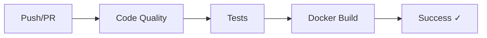
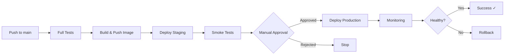

# TeachMe CI/CD - FastAPI Проект

Демонстрационное FastAPI приложение для изучения процессов Continuous Integration и Continuous Deployment.

## 📋 Описание проекта

Это учебный проект, демонстрирующий:
- ✅ Современный REST API на FastAPI
- 🐳 Контейнеризацию с Docker и Docker Compose
- 🔄 Автоматизированное тестирование с pytest
- 🚀 CI/CD процессы с GitHub Actions
- 📊 Мониторинг и health checks
- 🔒 Валидацию данных с Pydantic

## 🏗️ Архитектура

```
TeachMeCiCd/
├── app/                        # Основной код приложения
│   ├── __init__.py
│   ├── models.py              # Pydantic модели
│   └── routes/                # API endpoints
│       ├── __init__.py
│       ├── health.py          # Health check endpoints
│       └── users.py           # CRUD для пользователей
├── tests/                     # Тесты
│   ├── __init__.py
│   ├── test_health.py        # Smoke тесты
│   └── test_users.py         # Интеграционные тесты API
├── .github/
│   └── workflows/            # GitHub Actions workflows
│       ├── ci.yml            # Continuous Integration
│       ├── cd.yml            # Continuous Deployment
│       └── docker-test.yml   # Тесты Docker
├── main.py                   # Точка входа приложения
├── Dockerfile               # Docker образ
├── docker-compose.yml       # Docker Compose конфигурация
├── requirements.txt         # Python зависимости
├── pytest.ini              # Конфигурация pytest
└── .env.example            # Пример переменных окружения
```

## 🚀 Быстрый старт

### Предварительные требования

- Python 3.9+
- Docker и Docker Compose
- Git

### 1. Клонирование репозитория

```bash
git clone https://github.com/loguntsovae-teachmeskills/TeachMeCiCd.git
cd TeachMeCiCd
```

### 2. Запуск через Docker Compose (рекомендуется)

```bash
# Сборка и запуск контейнеров
docker compose up -d

# Просмотр логов
docker compose logs -f api

# Остановка
docker compose down
```

Приложение будет доступно по адресу: **http://localhost:8000**

### 3. Запуск локально (для разработки)

```bash
# Создание виртуального окружения
python -m venv venv
source venv/bin/activate  # На Windows: venv\Scripts\activate

# Установка зависимостей
pip install -r requirements.txt

# Копирование переменных окружения
cp .env.example .env

# Запуск приложения
python main.py

# Или через uvicorn
uvicorn main:app --reload --host 0.0.0.0 --port 8000
```

## 📚 Документация API

После запуска приложения доступна интерактивная документация:

- **Swagger UI**: http://localhost:8000/docs
- **ReDoc**: http://localhost:8000/redoc

### Основные endpoints

#### Health Checks
- `GET /health` - Полная проверка работоспособности
- `GET /healthz` - Kubernetes liveness probe
- `GET /readyz` - Kubernetes readiness probe

#### Users API
- `POST /api/v1/users` - Создание пользователя
- `GET /api/v1/users` - Получение списка пользователей
- `GET /api/v1/users/{user_id}` - Получение пользователя по ID
- `PUT /api/v1/users/{user_id}` - Обновление пользователя
- `DELETE /api/v1/users/{user_id}` - Удаление пользователя
- `GET /api/v1/users/search/by-username/{username}` - Поиск по username

### Примеры запросов

#### Создание пользователя

```bash
curl -X POST "http://localhost:8000/api/v1/users" \
  -H "Content-Type: application/json" \
  -d '{
    "email": "user@example.com",
    "username": "johndoe",
    "password": "securepass123",
    "full_name": "John Doe"
  }'
```

#### Получение списка пользователей

```bash
curl http://localhost:8000/api/v1/users
```

#### Проверка health

```bash
curl http://localhost:8000/health
```

## 🧪 Тестирование

### Запуск всех тестов

```bash
# Внутри виртуального окружения
pytest

# С подробным выводом
pytest -v

# С coverage отчетом
pytest --cov=. --cov-report=html
```

### Запуск определенных категорий тестов

```bash
# Только smoke тесты
pytest -m smoke

# Только интеграционные тесты
pytest -m integration

# Конкретный файл
pytest tests/test_users.py
```

### Запуск тестов в Docker

```bash
docker compose run --rm api pytest -v
```

## 🔄 CI/CD Pipeline

Проект использует GitHub Actions для автоматизации:

### CI Pipeline (`.github/workflows/ci.yml`)

Запускается при каждом push и pull request:

1. **Проверка качества кода**
   - Форматирование (Black)
   - Сортировка импортов (isort)
   - Линтинг (flake8)

2. **Тестирование**
   - Запуск на Python 3.9, 3.10, 3.11, 3.12
   - Smoke тесты
   - Полный набор тестов
   - Coverage отчеты

3. **Docker сборка**
   - Сборка образа
   - Запуск контейнера
   - Проверка работоспособности API

### CD Pipeline (`.github/workflows/cd.yml`)

Запускается при push в `main`:

1. **Полное тестирование**
   - Все тесты с coverage

2. **Сборка и публикация**
   - Сборка Docker образа
   - Публикация в GitHub Container Registry

3. **Деплой в Staging**
   - Автоматический деплой
   - Smoke тесты

4. **Деплой в Production**
   - Требует ручного одобрения
   - Создание бэкапа
   - Проверка работоспособности

5. **Мониторинг**
   - Проверка метрик
   - Анализ логов

6. **Откат при ошибке**
   - Автоматический откат к предыдущей версии

### Docker Compose Test (`.github/workflows/docker-test.yml`)

Тестирует работу приложения через Docker Compose:
- Запуск всех сервисов
- Проверка endpoints
- Создание тестовых данных

## 🐳 Docker

### Сборка образа вручную

```bash
# Сборка
docker build -t teachme-cicd-api .

# Запуск
docker run -d -p 8000:8000 --name api teachme-cicd-api

# Просмотр логов
docker logs -f api

# Остановка
docker stop api && docker rm api
```

### Docker Compose команды

```bash
# Запуск в фоне
docker compose up -d

# Пересборка и запуск
docker compose up -d --build

# Просмотр логов
docker compose logs -f

# Остановка без удаления
docker compose stop

# Остановка с удалением контейнеров и сетей
docker compose down

# Остановка с удалением volumes
docker compose down -v

# Запуск конкретного сервиса
docker compose up api

# Выполнение команды в контейнере
docker compose exec api python -c "print('Hello')"
```

## 🛠️ Разработка

### Установка зависимостей для разработки

```bash
pip install -r requirements.txt
```

### Форматирование кода

```bash
# Black для форматирования
black .

# isort для сортировки импортов
isort .

# flake8 для проверки
flake8 .
```

### Добавление новых endpoints

1. Создайте новую модель в `app/models.py`
2. Создайте новый роутер в `app/routes/`
3. Подключите роутер в `main.py`
4. Напишите тесты в `tests/`
5. Запустите тесты: `pytest`

### Горячая перезагрузка

При локальной разработке с `--reload` изменения применяются автоматически.

В Docker Compose изменения в `app/` и `main.py` также применяются автоматически благодаря volume mount.

## 📊 Мониторинг и Логирование

### Health Checks

Приложение предоставляет несколько endpoints для мониторинга:

```bash
# Подробный health check
curl http://localhost:8000/health

# Простой health check для Kubernetes
curl http://localhost:8000/healthz

# Readiness check
curl http://localhost:8000/readyz
```

### Логи

```bash
# Docker Compose логи
docker compose logs -f api

# Только последние 100 строк
docker compose logs --tail=100 api

# Docker логи
docker logs -f teachme-cicd-api
```

## 🔒 Безопасность

### Рекомендации для production

1. **Переменные окружения**: Не храните секреты в коде
2. **CORS**: Укажите конкретные домены вместо `["*"]`
3. **HTTPS**: Используйте SSL/TLS сертификаты
4. **Rate Limiting**: Добавьте ограничение частоты запросов
5. **Аутентификация**: Реализуйте JWT или OAuth2
6. **Валидация**: Всегда валидируйте входящие данные
7. **Логирование**: Не логируйте чувствительные данные

## 📝 Структура CI/CD

### Continuous Integration (CI)



### Continuous Deployment (CD)



## 🤝 Contributing

1. Fork репозиторий
2. Создайте feature branch (`git checkout -b feature/amazing-feature`)
3. Commit изменения (`git commit -m 'Add amazing feature'`)
4. Push в branch (`git push origin feature/amazing-feature`)
5. Откройте Pull Request

## 📄 Лицензия

MIT License

## 👨‍💻 Автор

TeachMeSkills Python Course

## 📚 Дополнительные ресурсы

- [FastAPI Documentation](https://fastapi.tiangolo.com/)
- [Docker Documentation](https://docs.docker.com/)
- [GitHub Actions Documentation](https://docs.github.com/en/actions)
- [pytest Documentation](https://docs.pytest.org/)
- [Pydantic Documentation](https://docs.pydantic.dev/)

## ❓ FAQ

**Q: Как изменить порт приложения?**  
A: Измените порт в `docker-compose.yml` (для Docker) или при запуске uvicorn.

**Q: Как добавить базу данных?**  
A: Раскомментируйте секцию PostgreSQL в `docker-compose.yml` и настройте подключение.

**Q: Тесты падают локально, но проходят в CI?**  
A: Проверьте версию Python и зависимости. Используйте виртуальное окружение.

**Q: Как посмотреть coverage отчет?**  
A: Запустите `pytest --cov=. --cov-report=html` и откройте `htmlcov/index.html`.

## 🎯 Roadmap

- [ ] Добавить PostgreSQL базу данных
- [ ] Реализовать JWT аутентификацию
- [ ] Добавить Redis для кеширования
- [ ] Настроить Kubernetes деплой
- [ ] Добавить Prometheus метрики
- [ ] Интегрировать ELK stack для логов
- [ ] Добавить GraphQL endpoint
- [ ] Реализовать WebSocket поддержку
